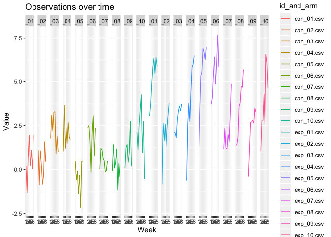
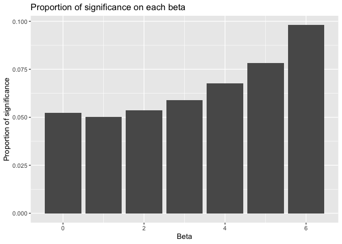
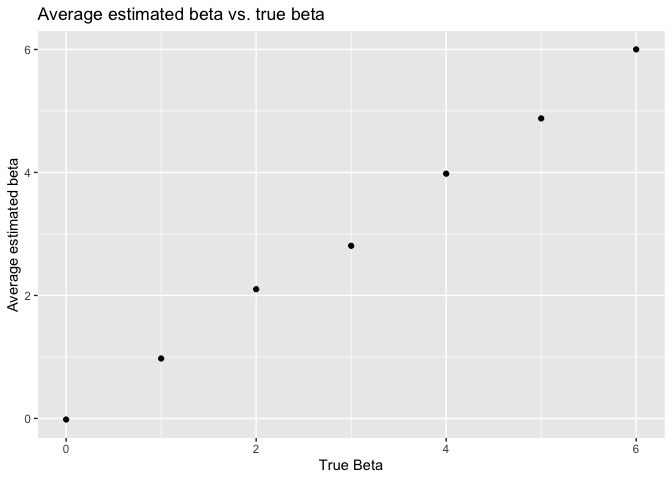
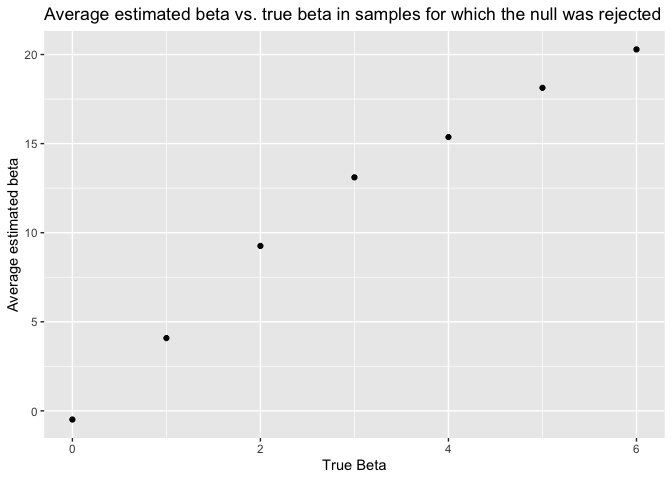

p8105\_hw5\_Ic3391.Rmd
================
Lu Chen
11/10/2019

Problem 1
---------

``` r
library(tidyverse)

set.seed(10)

iris_with_missing = iris %>% 
  map_df(~replace(.x, sample(1:150, 20), NA)) %>%
  mutate(Species = as.character(Species))

# replacing missing values for both numeric and character variables

na_replace = function(vec) {
  if (is.numeric(vec)) {
    vec = replace(vec, is.na(vec), round(mean(vec, na.rm = TRUE)))
  }
  else if (is.character(vec)) {
    vec = replace(vec, is.na(vec), "virginica")
  }
  vec #return the resulting vector
}

map (iris_with_missing,na_replace)
```

    ## $Sepal.Length
    ##   [1] 5.1 4.9 4.7 4.6 5.0 5.4 6.0 5.0 4.4 4.9 5.4 4.8 6.0 4.3 6.0 5.7 5.4
    ##  [18] 5.1 5.7 5.1 5.4 5.1 4.6 6.0 4.8 5.0 5.0 5.2 6.0 4.7 4.8 5.4 5.2 5.5
    ##  [35] 4.9 5.0 5.5 4.9 4.4 5.1 5.0 4.5 4.4 5.0 5.1 4.8 5.1 4.6 5.3 5.0 7.0
    ##  [52] 6.4 6.9 5.5 6.5 5.7 6.3 4.9 6.6 5.2 5.0 5.9 6.0 6.1 5.6 6.7 5.6 5.8
    ##  [69] 6.2 5.6 5.9 6.0 6.3 6.0 6.4 6.6 6.8 6.7 6.0 5.7 5.5 6.0 5.8 6.0 5.4
    ##  [86] 6.0 6.7 6.0 5.6 5.5 5.5 6.0 5.8 5.0 6.0 5.7 5.7 6.2 5.1 5.7 6.3 5.8
    ## [103] 7.1 6.3 6.5 7.6 4.9 7.3 6.7 6.0 6.5 6.0 6.8 5.7 5.8 6.4 6.5 7.7 7.7
    ## [120] 6.0 6.0 5.6 7.7 6.3 6.7 7.2 6.2 6.1 6.4 7.2 7.4 7.9 6.4 6.0 6.1 6.0
    ## [137] 6.0 6.4 6.0 6.9 6.7 6.9 6.0 6.8 6.7 6.7 6.3 6.5 6.0 5.9
    ## 
    ## $Sepal.Width
    ##   [1] 3.5 3.0 3.2 3.1 3.6 3.9 3.4 3.4 2.9 3.1 3.0 3.4 3.0 3.0 4.0 4.4 3.9
    ##  [18] 3.5 3.8 3.8 3.4 3.7 3.6 3.3 3.4 3.0 3.4 3.5 3.4 3.2 3.1 3.0 3.0 4.2
    ##  [35] 3.1 3.2 3.5 3.6 3.0 3.4 3.5 3.0 3.2 3.5 3.8 3.0 3.8 3.2 3.7 3.0 3.0
    ##  [52] 3.2 3.1 2.3 2.8 2.8 3.3 2.4 2.9 2.7 2.0 3.0 2.2 2.9 2.9 3.1 3.0 3.0
    ##  [69] 2.2 2.5 3.2 2.8 2.5 2.8 2.9 3.0 2.8 3.0 3.0 2.6 2.4 2.4 2.7 2.7 3.0
    ##  [86] 3.4 3.1 3.0 3.0 2.5 3.0 3.0 3.0 2.3 2.7 3.0 2.9 2.9 2.5 2.8 3.0 2.7
    ## [103] 3.0 2.9 3.0 3.0 2.5 2.9 3.0 3.6 3.2 2.7 3.0 3.0 2.8 3.2 3.0 3.8 2.6
    ## [120] 2.2 3.2 3.0 2.8 2.7 3.3 3.2 2.8 3.0 2.8 3.0 2.8 3.8 2.8 2.8 3.0 3.0
    ## [137] 3.4 3.1 3.0 3.1 3.1 3.1 2.7 3.2 3.3 3.0 2.5 3.0 3.4 3.0
    ## 
    ## $Petal.Length
    ##   [1] 1.4 1.4 1.3 1.5 1.4 1.7 1.4 1.5 1.4 4.0 1.5 1.6 1.4 4.0 4.0 1.5 1.3
    ##  [18] 1.4 1.7 1.5 1.7 1.5 1.0 4.0 1.9 4.0 1.6 1.5 1.4 1.6 4.0 1.5 1.5 1.4
    ##  [35] 4.0 1.2 1.3 1.4 1.3 1.5 1.3 1.3 1.3 1.6 1.9 1.4 1.6 4.0 1.5 1.4 4.7
    ##  [52] 4.5 4.9 4.0 4.6 4.5 4.7 4.0 4.6 3.9 4.0 4.2 4.0 4.7 3.6 4.4 4.5 4.1
    ##  [69] 4.5 3.9 4.8 4.0 4.9 4.0 4.3 4.4 4.8 5.0 4.5 3.5 3.8 3.7 3.9 5.1 4.5
    ##  [86] 4.5 4.7 4.4 4.0 4.0 4.4 4.6 4.0 3.3 4.2 4.2 4.2 4.3 3.0 4.1 4.0 5.1
    ## [103] 5.9 5.6 5.8 6.6 4.5 6.3 4.0 4.0 5.1 5.3 5.5 5.0 5.1 5.3 4.0 6.7 6.9
    ## [120] 5.0 5.7 4.9 6.7 4.9 5.7 6.0 4.8 4.9 5.6 5.8 6.1 4.0 4.0 5.1 5.6 6.1
    ## [137] 5.6 5.5 4.8 5.4 5.6 5.1 5.1 4.0 4.0 5.2 5.0 5.2 5.4 5.1
    ## 
    ## $Petal.Width
    ##   [1] 0.2 0.2 0.2 1.0 0.2 0.4 0.3 0.2 0.2 0.1 0.2 0.2 0.1 0.1 0.2 0.4 0.4
    ##  [18] 1.0 0.3 1.0 0.2 0.4 0.2 0.5 0.2 0.2 0.4 0.2 0.2 0.2 0.2 0.4 0.1 0.2
    ##  [35] 0.2 0.2 0.2 0.1 1.0 0.2 0.3 1.0 0.2 0.6 0.4 0.3 0.2 0.2 0.2 0.2 1.4
    ##  [52] 1.5 1.5 1.3 1.5 1.3 1.6 1.0 1.3 1.4 1.0 1.5 1.0 1.4 1.3 1.4 1.5 1.0
    ##  [69] 1.5 1.1 1.8 1.3 1.5 1.2 1.3 1.4 1.4 1.0 1.0 1.0 1.1 1.0 1.2 1.6 1.5
    ##  [86] 1.6 1.0 1.3 1.0 1.0 1.2 1.0 1.0 1.0 1.3 1.2 1.3 1.3 1.0 1.3 2.5 1.9
    ## [103] 2.1 1.8 2.2 2.1 1.7 1.8 1.8 2.5 2.0 1.9 2.1 2.0 2.4 2.3 1.8 1.0 2.3
    ## [120] 1.5 1.0 2.0 2.0 1.8 2.1 1.8 1.8 1.8 2.1 1.6 1.0 2.0 2.2 1.5 1.4 2.3
    ## [137] 1.0 1.0 1.8 2.1 2.4 2.3 1.9 2.3 2.5 2.3 1.9 2.0 2.3 1.8
    ## 
    ## $Species
    ##   [1] "setosa"     "setosa"     "setosa"     "setosa"     "setosa"    
    ##   [6] "setosa"     "setosa"     "setosa"     "setosa"     "setosa"    
    ##  [11] "setosa"     "setosa"     "setosa"     "setosa"     "setosa"    
    ##  [16] "setosa"     "setosa"     "setosa"     "setosa"     "setosa"    
    ##  [21] "setosa"     "virginica"  "setosa"     "setosa"     "virginica" 
    ##  [26] "setosa"     "virginica"  "setosa"     "setosa"     "setosa"    
    ##  [31] "setosa"     "setosa"     "setosa"     "setosa"     "setosa"    
    ##  [36] "setosa"     "setosa"     "setosa"     "setosa"     "setosa"    
    ##  [41] "setosa"     "virginica"  "setosa"     "setosa"     "setosa"    
    ##  [46] "virginica"  "setosa"     "setosa"     "setosa"     "setosa"    
    ##  [51] "virginica"  "versicolor" "versicolor" "versicolor" "versicolor"
    ##  [56] "versicolor" "virginica"  "versicolor" "virginica"  "versicolor"
    ##  [61] "versicolor" "versicolor" "versicolor" "versicolor" "versicolor"
    ##  [66] "versicolor" "versicolor" "versicolor" "versicolor" "versicolor"
    ##  [71] "versicolor" "virginica"  "versicolor" "versicolor" "versicolor"
    ##  [76] "versicolor" "versicolor" "versicolor" "versicolor" "virginica" 
    ##  [81] "versicolor" "versicolor" "versicolor" "versicolor" "versicolor"
    ##  [86] "versicolor" "versicolor" "versicolor" "versicolor" "versicolor"
    ##  [91] "versicolor" "versicolor" "versicolor" "virginica"  "versicolor"
    ##  [96] "versicolor" "versicolor" "versicolor" "versicolor" "virginica" 
    ## [101] "virginica"  "virginica"  "virginica"  "virginica"  "virginica" 
    ## [106] "virginica"  "virginica"  "virginica"  "virginica"  "virginica" 
    ## [111] "virginica"  "virginica"  "virginica"  "virginica"  "virginica" 
    ## [116] "virginica"  "virginica"  "virginica"  "virginica"  "virginica" 
    ## [121] "virginica"  "virginica"  "virginica"  "virginica"  "virginica" 
    ## [126] "virginica"  "virginica"  "virginica"  "virginica"  "virginica" 
    ## [131] "virginica"  "virginica"  "virginica"  "virginica"  "virginica" 
    ## [136] "virginica"  "virginica"  "virginica"  "virginica"  "virginica" 
    ## [141] "virginica"  "virginica"  "virginica"  "virginica"  "virginica" 
    ## [146] "virginica"  "virginica"  "virginica"  "virginica"  "virginica"

Problem 2
---------

``` r
tibble(list.files(path = "./data")) %>% 
  rename(id_and_arm = `list.files(path = "./data")`) %>% 
  mutate(add_up = "./data/", change_wd = str_c(add_up, id_and_arm), data = map(change_wd, read.csv)) %>% 
  unnest() %>% 
  pivot_longer(
    week_1:week_8,
    names_to = "week",
    names_prefix = "week_",
    values_to = "value"
    ) %>% 
  subset.data.frame(select = c("id_and_arm","week","value")) %>% 
  ggplot(aes(x = week, y = value, group = id_and_arm, color = id_and_arm)) +
  geom_line() +
  facet_grid(.~id_and_arm) +
  labs(
    title = "Observations over time",
    x = "Week", 
    y = "Value"
    ) 
```



``` r
#comments: In general, the experiment group receives higher value compared to the control group.Participants in the experiment group have a great improvement in values at certain observation time period.
```

Problem 3
---------

``` r
#hypothesis testing

sim_regression = function(n=30, beta0=2, beta1=0){
  sim_data = tibble(
    x = rnorm(n, mean = 1, sd = 1),
    y = beta0 + beta1 * x + rnorm(n, 0, 50)
  )
  
  ls_fit = lm(y ~ x, data = sim_data)
  
  tibble(
    beta1_hat = coef(ls_fit)[2],
    p_value = broom::tidy(ls_fit)[[2,5]]
  )
}

sim_regression()
```

    ## # A tibble: 1 x 2
    ##   beta1_hat p_value
    ##       <dbl>   <dbl>
    ## 1      14.3   0.207

``` r
s_0 = 
  rerun(10000, sim_regression(30, 2, 0)) %>% 
  bind_rows() %>% 
  mutate (beta = 0) 

sim_results_0 = 
  s_0 %>% 
  mutate(significane = case_when(p_value < 0.05 ~ "1", TRUE ~ "0")) %>% 
  summarize(n_significane = sum(as.numeric(significane))) %>% 
  mutate(proportion = n_significane/10000) %>% 
  mutate (beta = 0) 

ss_0 = 
  rerun(10000, sim_regression(30, 2, 0)) %>% 
  bind_rows() %>% 
  mutate (beta = 0) %>% 
  mutate(significane = case_when(p_value < 0.05 ~ "1", TRUE ~ "0"))

s_1 = 
  rerun(10000, sim_regression(30, 2, 1)) %>% 
  bind_rows() %>% 
  mutate (beta = 1)  

sim_results_1 =
  s_1 %>% 
  mutate(significane = case_when(p_value < 0.05 ~ "1", TRUE ~ "0")) %>% 
  summarize(n_significane = sum(as.numeric(significane))) %>% 
  mutate(proportion = n_significane/10000)  %>% 
  mutate (beta = 1) 

ss_1 = 
  rerun(10000, sim_regression(30, 2, 1)) %>% 
  bind_rows() %>% 
  mutate (beta = 1) %>% 
  mutate(significane = case_when(p_value < 0.05 ~ "1", TRUE ~ "0"))

s_2 =
  rerun(10000, sim_regression(30, 2, 2)) %>% 
  bind_rows() %>% 
  mutate (beta = 2) 

sim_results_2 = 
  s_2 %>% 
  mutate(significane = case_when(p_value < 0.05 ~ "1", TRUE ~ "0")) %>% 
  summarize(n_significane = sum(as.numeric(significane))) %>% 
  mutate(proportion = n_significane/10000) %>% 
  mutate (beta = 2)

ss_2 = 
  rerun(10000, sim_regression(30, 2, 2)) %>% 
  bind_rows() %>% 
  mutate (beta = 2) %>% 
  mutate(significane = case_when(p_value < 0.05 ~ "1", TRUE ~ "0"))


s_3 = 
  rerun(10000, sim_regression(30, 2, 3)) %>% 
  bind_rows() %>% 
  mutate (beta = 3)  

sim_results_3 = 
  s_3 %>% 
  mutate(significane = case_when(p_value < 0.05 ~ "1", TRUE ~ "0")) %>% 
  summarize(n_significane = sum(as.numeric(significane))) %>% 
  mutate(proportion = n_significane/10000) %>% 
  mutate (beta = 3)

ss_3 = 
  rerun(10000, sim_regression(30, 2, 3)) %>% 
  bind_rows() %>% 
  mutate (beta = 3) %>% 
  mutate(significane = case_when(p_value < 0.05 ~ "1", TRUE ~ "0"))


s_4 =
  rerun(10000, sim_regression(30, 2, 4)) %>% 
  bind_rows() %>% 
  mutate (beta = 4)

sim_results_4 = 
  s_4 %>% 
  mutate(significane = case_when(p_value < 0.05 ~ "1", TRUE ~ "0")) %>% 
  summarize(n_significane = sum(as.numeric(significane))) %>% 
  mutate(proportion = n_significane/10000)  %>% 
  mutate (beta = 4)

ss_4 = 
  rerun(10000, sim_regression(30, 2, 4)) %>% 
  bind_rows() %>% 
  mutate (beta = 4) %>% 
  mutate(significane = case_when(p_value < 0.05 ~ "1", TRUE ~ "0"))

s_5 = 
  rerun(10000, sim_regression(30, 2, 5)) %>% 
  bind_rows() %>% 
  mutate (beta = 5)

sim_results_5 = 
  s_5 %>% 
  mutate(significane = case_when(p_value < 0.05 ~ "1", TRUE ~ "0")) %>% 
  summarize(n_significane = sum(as.numeric(significane))) %>% 
  mutate(proportion = n_significane/10000)  %>% 
  mutate (beta = 5)

ss_5 = 
  rerun(10000, sim_regression(30, 2, 5)) %>% 
  bind_rows() %>% 
  mutate (beta = 5) %>% 
  mutate(significane = case_when(p_value < 0.05 ~ "1", TRUE ~ "0"))

s_6 = 
  rerun(10000, sim_regression(30, 2, 6)) %>% 
  bind_rows() %>% 
  mutate (beta = 6)

sim_results_6 = 
  s_6 %>% 
  mutate(significane = case_when(p_value < 0.05 ~ "1", TRUE ~ "0")) %>% 
  summarize(n_significane = sum(as.numeric(significane))) %>% 
  mutate(proportion = n_significane/10000) %>% 
  mutate (beta = 6) 

ss_6 = 
  rerun(10000, sim_regression(30, 2, 6)) %>% 
  bind_rows() %>% 
  mutate (beta = 6) %>% 
  mutate(significane = case_when(p_value < 0.05 ~ "1", TRUE ~ "0"))

sim_results_6
```

    ## # A tibble: 1 x 3
    ##   n_significane proportion  beta
    ##           <dbl>      <dbl> <dbl>
    ## 1           980      0.098     6

``` r
t = bind_rows(sim_results_0,sim_results_1,sim_results_2,sim_results_3,sim_results_4,sim_results_5,sim_results_6) 
  
ggplot(t, aes(x = beta, y = proportion)) +
geom_bar(stat = 'identity') +
labs(
  title = "Proportion of significance on each beta",
  x = "Beta", 
  y = "Proportion of significance"
) 
```



``` r
# comments: when the beta increases, the proportion of significance increases, meaning the effect size and power are postively associated.

# average estimated beta1

t_2 = bind_rows(s_0, s_1, s_2, s_3, s_4, s_5, s_6)

t_2 %>% 
  group_by(beta) %>% 
  summarize(mean_beta1 = mean(beta1_hat)) %>% 
  ggplot(aes(x = beta, y = mean_beta1)) +
  geom_point() +
  labs(
   title = "Average estimated beta vs. true beta",
   x = "True Beta", 
    y = "Average estimated beta"
  ) 
```



``` r
t_3= bind_rows(ss_0, ss_1, ss_2, ss_3, ss_4, ss_5, ss_6)

t_3 %>% 
  filter(significane %in% c("1")) %>% 
  group_by(beta) %>% 
  summarize(mean_beta1 = mean(beta1_hat)) %>% 
  ggplot(aes(x = beta, y = mean_beta1)) +
  geom_point() +
  labs(
   title = "Average estimated beta vs. true beta in samples for which the null was rejected",
   x = "True Beta", 
    y = "Average estimated beta"
  ) 
```



``` r
# comments: The sample average of beta1 across tests for which the null is rejected is not approximately equal to the true value of beta1. One reason is that the effect size influences the power. When we have greater effect size, for example, when beta1 = 6, we might have 8000 samples significiant, which leads to a biased result. 
```
